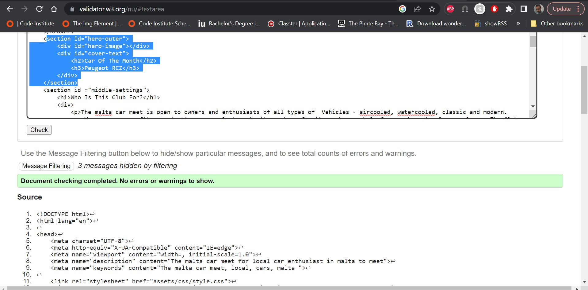
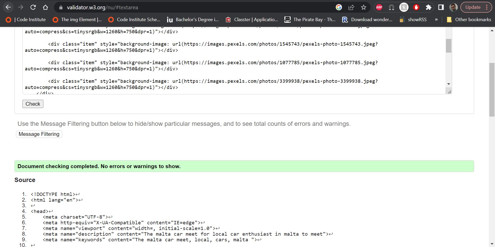
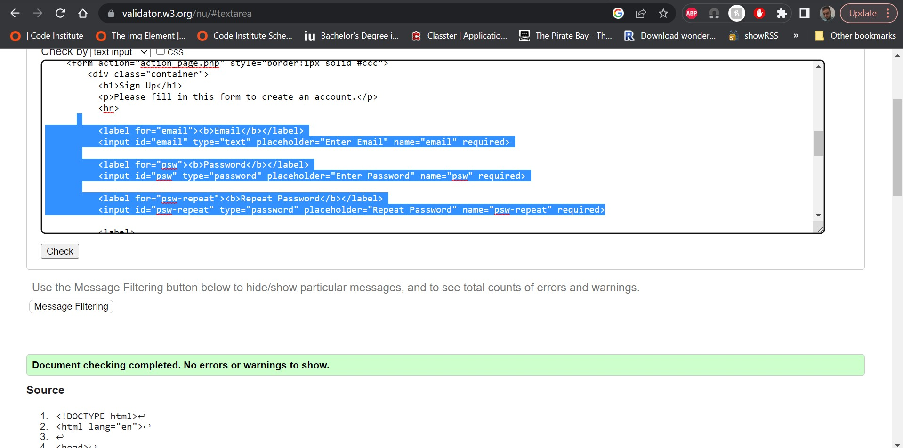
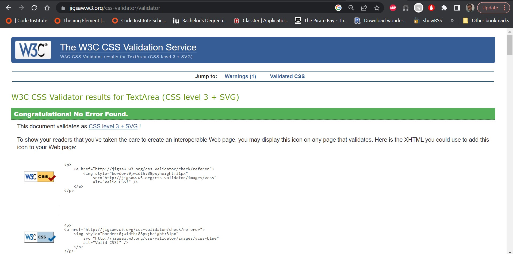

# The-Malta-Car-Meet Website
 
## Overview
 
### What is this website for?
 This website is for car meet ups in Malta. with the plan looking like the picture below as reference.


 
### What does it do?
 From this website you can view the place where the next events will take place, pictures and video from gallary and sign up to get the latest updates of new events.

 
### How does it work
 
This website uses **AngularJS** to route viewers through the site and control which **Javascript** is executed. The site is styled with **Bootstrap**. The quiz has been created using **Javascript** and modal for enlarging images is displayed using some **JQuery** code. **Bower** has been used to manage package dependencies for deployment of site on github pages. The site can be viewed [HERE](https://gdv373.github.io/The-Malta-Car-Meet-media/)

## Features
 
### Existing Features
- Eye catching front page with event winner picture
  - grid picture box in gallary
- Information page.
  - Top navigation to go to different parts of the website
- Media page with pictures and a video
- Links page to social media
### Features Left to Implement
- None

## Tech Used
HTML , CSS

## Testing
- Prototype code was written and tested using several web browsers
- All code used on the site has been tested to ensure everything is working as expected
- Site viewed and tested in the following browsers:
  - Google Chrome
  - Opera
  - Microsoft Edge
  - Mozilla Firefox

- HTML Validtior by - https://validator.w3.org/

  -Index page
  

  -Gallary page
  

  -Sign up page
  

- CSS Validator by - https://jigsaw.w3.org/css-validator

  


## Contributing
 
### Getting the code up and running
1. Firstly you will need to clone this repository by running the ```git clone <project's Github URL>``` command
2. After you've that you'll need to make sure that you have **npm** installed
  1. You can get **npm** by installing Node from [here](https://nodejs.org/en/)
4. After those dependencies have been installed you'll need to make sure that you have **http-server** installed. You can install this by running the following: ```npm install -g http-server # this also may require sudo on Mac/Linux```
5. Once **http-server** is installed run ```http-server -c-1```
6. The project will now run on [localhost](http://127.0.0.1:8080)
7. Make changes to the code and if you think it belongs in here then just submit a pull request

## Credits

### Media
- The photos used in this site were obtained from [Pixabay]
- Youtube video was obtained from account Gumbal [https://www.youtube.com/@Gumbal]

