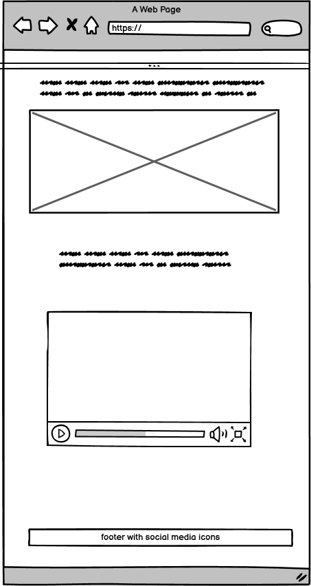
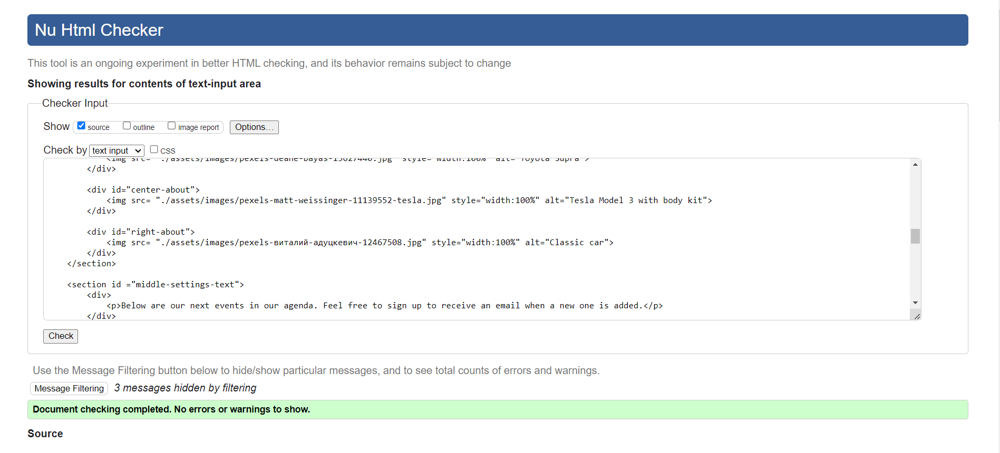

# The-Malta-Car-Meet Website

[View the live project here](https://gdv373.github.io/The-Malta-Car-Meet-media/)

## Table of contents
1. [Introduction](#Introduction)
2. [How does it work](#How-does-it-work)
3. [UX](#UX)
    1. [Ideal User Demographic](#Ideal-User-Demographic)
    2. [User Stories](#User-Stories)
    3. [Development Planes](#Development-Planes)
4. [Features](#Features)
    1. [Design Features](#Design-Features) 
    2. [Existing Features](#Existing-Features)
    3. [Features to Implement in the future](#Features-to-Implement-in-the-future)
5. [Technologies Used](#Technologies-Used)
     1. [Main Languages Used](#Main-Languages-Used)
     3. [Frameworks, Libraries & Programs Used](#Frameworks,-Libraries-&-Programs-Used)
6. [Testing](#Testing)
7. [Deployment](#Deployment)
     1. [Deploying on GitHub Pages](#Deploying-on-GitHub-Pages)
8. [Credits](#Credits)
     2. [Media](#Media)
     3. [Code](#Code)
9. [Acknowledgements](#Acknowledgements)
***

## Introduction

From this website you can view the place where the next events will take place, pictures and video from gallary and sign up to get the latest updates of new events.

## How does it work
 
This website uses **AngularJS** to route viewers through the site and control which **Javascript** is executed. The site is styled with **Bootstrap**. The quiz has been created using **Javascript** and modal for enlarging images is displayed using some **JQuery** code. **Bower** has been used to manage package dependencies for deployment of site on github pages. The site can be viewed [HERE](https://gdv373.github.io/The-Malta-Car-Meet-media/)

## UX
### Ideal User Demographic
The ideal user for this website is:
* Current user
* New user
* Car enthusiast

### User-Stories
#### Current User Goals
1. As a current user, I want to see regular updates to the information and new events.
2. As a current user, I want to easily navigate through the site and access the information I require with ease.
3. As a current user, I want to easily navigate to content I have previously viewed within a small number of steps.

#### New User Goals
1. As a new user, I want to easily navigate the entire site intuitively. 
2. As a new user, I want the information I seek to be easily accessible and relevant.
3. As a new user, I want attractive and relevant visuals and colour schemes that work with the content.

### Development-Planes
To create a comprehensive website that has a gallary of the latest events with videos and images. Locations of meetups and an easy contact us page with easy way to contact us.

#### Structure
The information above was then organized in a hierarchical tree structure, a site map, showing how users can navigate through the site with ease and efficiency, with the following results:

#### Skeleton
Wireframes were made to showcase the appearance of the site pages while keeping a positive user experience in mind. The wireframes were created using a desktop version of [Balsamiq](https://balsamiq.com/).

Balsamiq Wireframes

-Index page frame work

-Gallery page frame work

-Sign up page frame work

  

In addition to this, concept art was made using Balsmamiq to showcase the appearance of the home page. The concept art made some improvements upon the initial wireframes with regards to layout and features. but stayed mostly true to the original design.

### Design
#### Colour Scheme

For the color scheme a modern black and white team was chosen as it also allows color blind users to easly navigate the website.
Background for text used where the following:
- rgba(39, 29, 29, 0.7); - On Homepage Car of the month
- rgba(0, 0, 0, 0.6); - On Homepage Events
- rgb(58, 58, 58); - Social network logo color in all footers
- color: #252525; - H1 and H2 color
- color: #3A3A3A; - Paragraphs and a tags

#### Typography

The typography pairing used on the site are [Caveat]https://fonts.google.com/specimen/Caveat?query=caveat, and [Edu QLD Beginner](https://fonts.google.com/specimen/Edu+QLD+Beginner?query=Edu+QLD+Beginner), imported from [Google Fonts](https://fonts.google.com/). A backup of cursive or Sans-Serif had been applied in case of import failure.

Caveat was chosen for the Main H1 and H2 , with the rest using the font Edu QLD Beginner. 

#### Imagery
The selected imagery has been sourced from Pixabay as a free source.

Various images, found in the images folder,  these are beening used across the site. 

## Features
### Design Features

### Existing Features
- Eye catching front page with event winner picture
  - grid picture box in gallary
- Information page.
  - Top navigation to go to different parts of the website
- Media page with pictures and a video
- Links page to social media

### Features Left to Implement
- None

    
## Technologies Used
### Main Languages Used
- [HTML5](https://en.wikipedia.org/wiki/HTML5 "Link to HTML Wiki")
- [CSS3](https://en.wikipedia.org/wiki/Cascading_Style_Sheets "Link to CSS Wiki")

### Frameworks, Libraries & Programs Used
- [Google Fonts](https://fonts.google.com/ "Link to Google Fonts")
    - Google fonts was used to import the fonts into the style.css file. These fonts were used throughout the project.
- [Font Awesome](https://fontawesome.com/ "Link to FontAwesome")
     - Font Awesome was used on almost all pages throughout the website to import icons (e.g. social media icons) for UX purposes.
- [GitPod](https://gitpod.io/ "Link to GitPod homepage")
     - GitPod was used for writing code, commiting, and then pushing to GitHub.
- [GitHub](https://github.com/ "Link to GitHub")
     - GitHub was used to store the project after pushing
- [Balsamiq](https://balsamiq.com/ "Link to Balsamiq homepage")
     - Balsamiq was used to create the wireframes during the design phase of the project.

## Testing
- Prototype code was written and tested using several web browsers
- All code used on the site has been tested to ensure everything is working as expected
- Site viewed and tested in the following browsers:
  - Google Chrome
  - Opera
  - Microsoft Edge
  - Mozilla Firefox

- HTML Validtior by - https://validator.w3.org/
- HTML and CSS validation was done via Direct manual input for each page as these is a known bug with font awesome causing an unfiaxble error using URL Validate

  -Index page
 

 
HTML_index_validation

 
 

  -Gallary page
  

  
Gallary page

  
  

  -Sign up page
  

  
Sign up page

  
  

- CSS Validator by - https://jigsaw.w3.org/css-validator
  

  
style Page

  
  

- lighthouse performance

  

  

  
  

## Deployment

This project was developed using [GitPod](https://www.gitpod.io/ "Link to GitPod site"), which was then committed and pushed to GitHub using the GitPod terminal.

### Deploying on GitHub Pages
To deploy this page to GitHub Pages from its GitHub repository, the following steps were taken:

1. Log into [GitHub](https://github.com/login "Link to GitHub login page") or [create an account](https://github.com/join "Link to GitHub create account page").
2. Locate the [GitHub Repository](https://github.com/GDV373/The-Malta-Car-Meet-media "Link to GitHub Repo").
3. At the top of the repository, select Settings from the menu items.
4. Scroll down the Settings page to the "Pages" section.
5. Under "Source" click the drop-down menu labelled "None" and select "Main".
6. Upon selection, the page will automatically refresh meaning that the website is now deployed.
7. Scroll back down to the "Pages" section to retrieve the deployed link.
    

    
## Credits 

### Media
- Almost all images were sourced from the various artists from [Pixabay](https://pixabay.com/ "Link to Pixabay").
- All videos were sourced from Gumbal`s channel on [YouTube](https://www.youtube.com/@Gumbal "Link to Gumbal YouTube Home Page")

### Code 
The code was made from the skeleton of the example used in the coders coffee house but it was implimented in my own way. Using different stratages of colors ,placements and use for the website. 

## Acknowledgements

- I would like to thank my family for their valued opinions and critic during the process of design and development, espacially my wife while trying to hold down the fort with our 3 week old daughter Millie <3 .
- I would like to thank my mentor, Brian Macharia , for helping me to give a better knowladge about what was needed for the project. This was very helpfull as this was my last attempt to pass this test.
- Thank you for all of the support. 

***